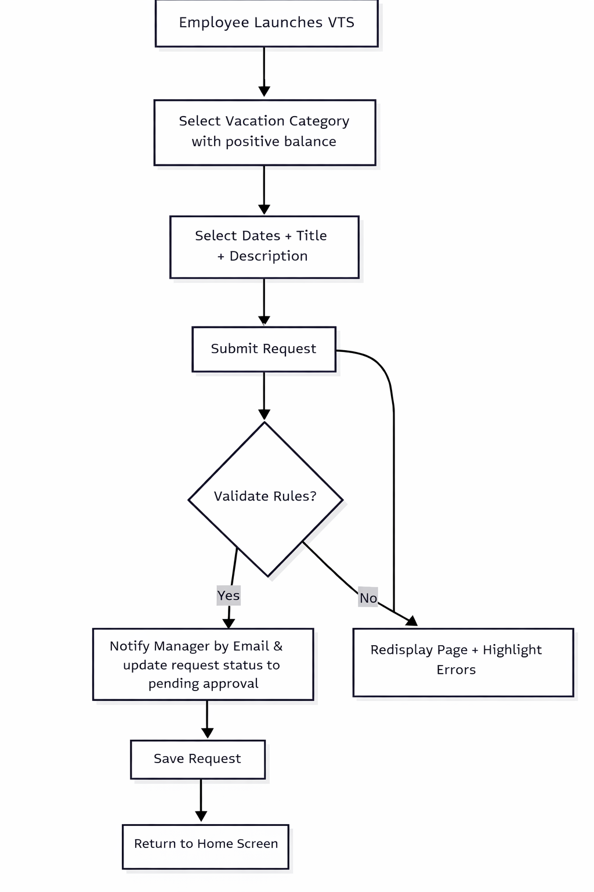
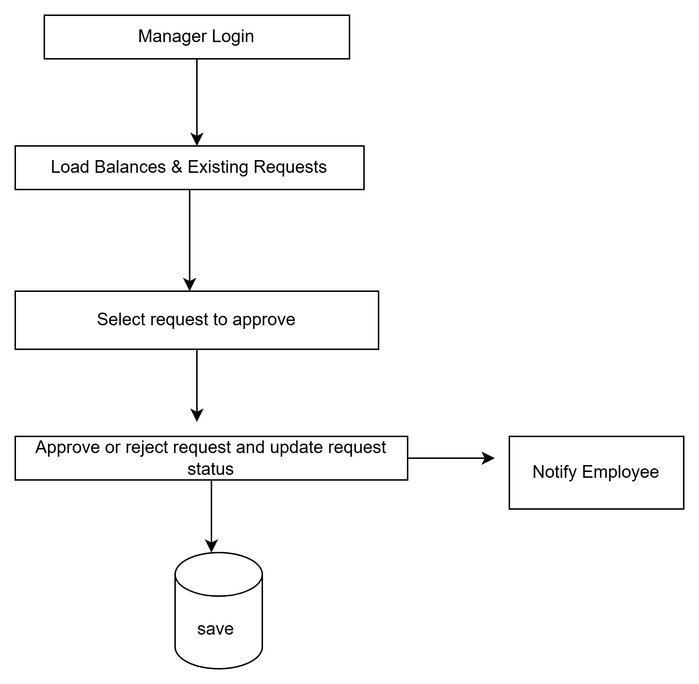
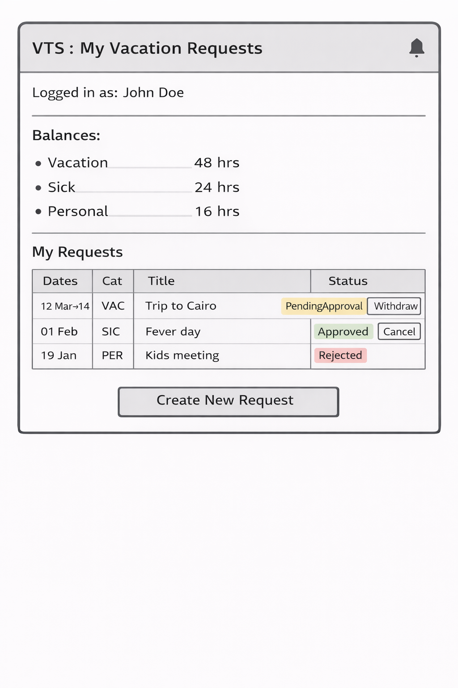
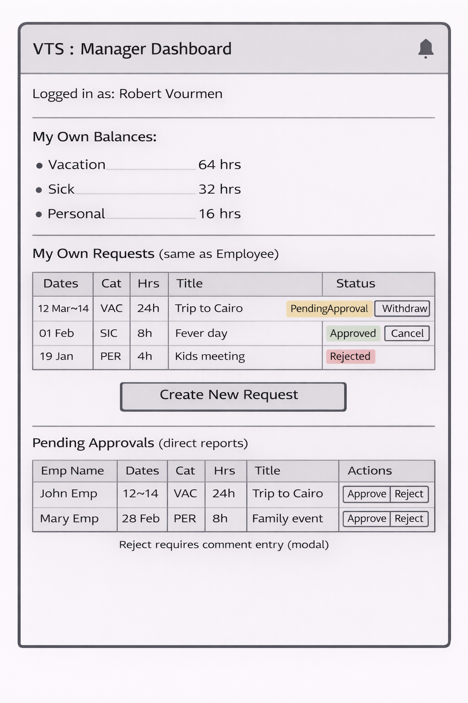
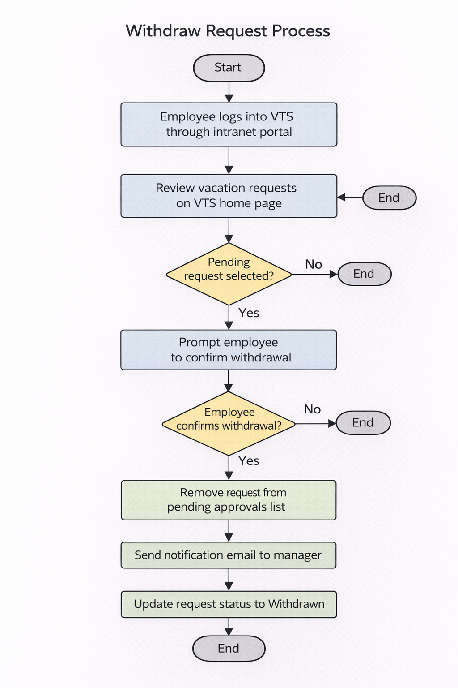
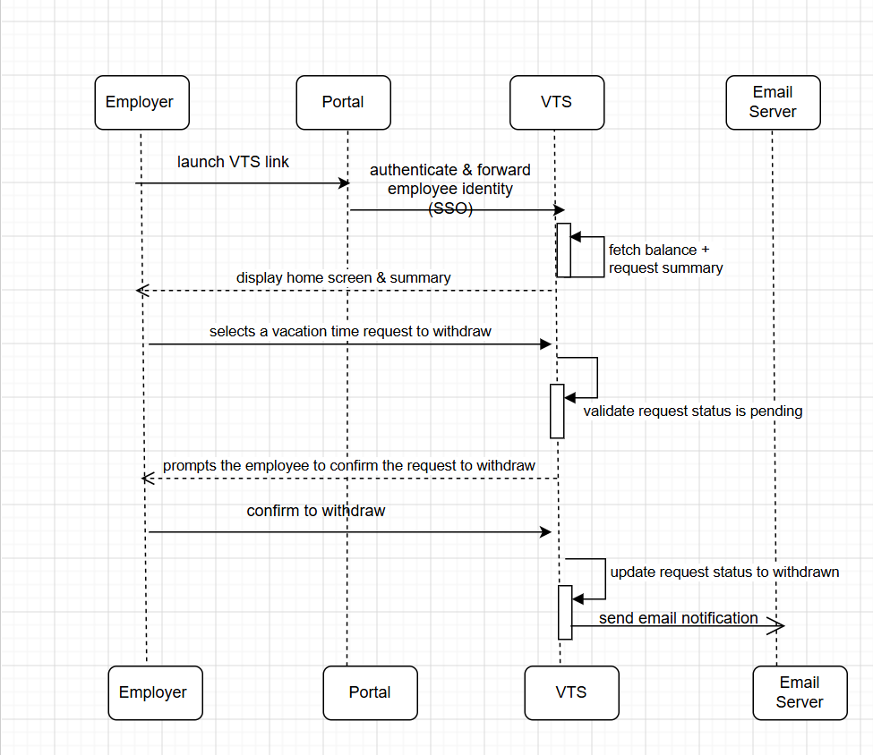
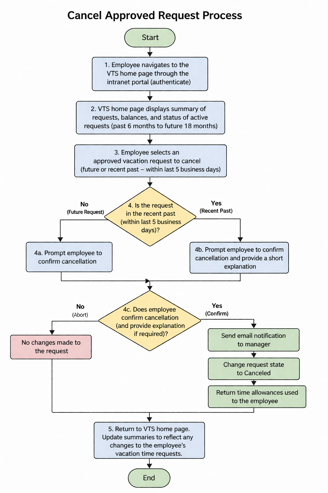
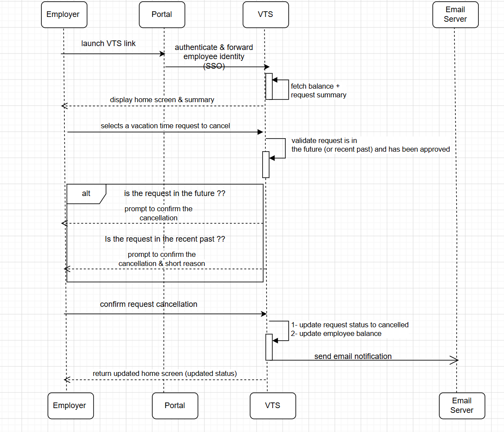

# Vacation Tracking System — Requirements Summary

## 1. Vision

A Vacation Tracking System (VTS) will provide individual employees with the capability to manage their own vacation
time, sick leave, and personal time off, without needing to be an expert in company or location policies.

The system must be **easy to use**.

Goal / motivation:

- streamline HR operations
- reduce non‑core management activities
- empower employees

## 2. Functional Requirements (Key Features)

- flexible rules‑based validation engine
- optional manager approval workflow
- view past 6 months and request up to 18 months ahead
- email notification for request status change
- extend existing intranet portal (SSO)
- activity logging of all transactions
- HR + admin override
- managers can award extra comp time (with limits)
- web service for other systems to query summary
- integrate with HR legacy data

## 3. Non‑Functional Requirements

- usability: must be intuitive / easy‑to‑use is primary
- Uses existing hardware and middleware

## 4. Constraints

- must run on existing intranet portal infrastructure
- must reuse existing hardware + middleware
- HR rules are maintained by HR, not developers
- approval may be optional depending employee level
- use email infrastructure already in place

## 5. Domain — Define the Problem

Employees request time off → request must satisfy rules (company + location) → request may require manager approval →
request becomes Approved / Rejected / Canceled / Withdrawn.

Rules vary by type of time + location + coworker coverage + holiday adjacency, etc.

## 6. Actors

| Actor        | Description                                          |
|--------------|------------------------------------------------------|
| Employee     | creates, views, withdraws, cancels vacation requests |
| Manager      | approves/denies + can award comp time                |
| HR Clerk     | manages employee / category / location / override    |
| System Admin | manages logs + infra                                 |

## 7. Data Model

| Entity           | Attributes                                                                                                      |
|------------------|-----------------------------------------------------------------------------------------------------------------|
| Employee         | id, name, email, location, role_id , manager_id,create_date,create_by                                           |
| Vacation Request | id, employee_id,manager_id,type,request_date, start_date, end_date,description,balance, status,approval_comment |
| Role             | id, name,role_code                                                                                              |
| Vacation Type    | id, name, vacation_code                                                                                         |
| Location         | id, name, location_code                                                                                         |
| Request Status   | id, name, status_code                                                                                           |
| Employee Balance | id, employee_id, vacation_type_id, balance,balance_year,current_balance, last_updated_date                      |

  - Role: defines employee role (e.g. employee, manager, HR , admin) which may affect approval requirements.
  - Vacation Type: defines type of time off (e.g. vacation, sick leave, personal time) which may have different rules.
  - Request Status: defines status of a vacation request (e.g. pending, approved, rejected, withdrawn,HR_Pending, HR_Approval).
---

## 8. Use Case: Manage Time

### 8.1 Flowchart



### 8.2 Sequence Diagram


### 8.3 Pseudocode (manage time – main flow)

```
authenticate(employee)
summary = load_request_summary(employee)

if employee.action == "new_request":
    req = build_request_form()
    if validate(req) == false:
        show_errors()
    else:
        save(req)
        if req.requires_manager_approval:
            send_email(manager)
        show_home()
```
### 8.4 UI Mockup



## 9. Use Case: Withdraw Request
### Goal: 
- The employee wants to withdraw an outstanding request for vacation time.
### 9.1 preconditions
- An employee has made a vacation time request, and that request has yet to be approved or denied by an authorized manager.
### 9.2 Flowchart Diagram


### 9.3 Sequence Diagram


## 10. Use Case: Cancel Approved Request
### Goal:
- The employee wants to cancel an approved vacation time request.
### 10.1 Preconditions
- The employee has a vacation time request that has been approved and is scheduled for some time in the future or the recent past (previous 5 business days).
### 10.2 Flowchart Diagram


### 10.3 Sequence Diagram
